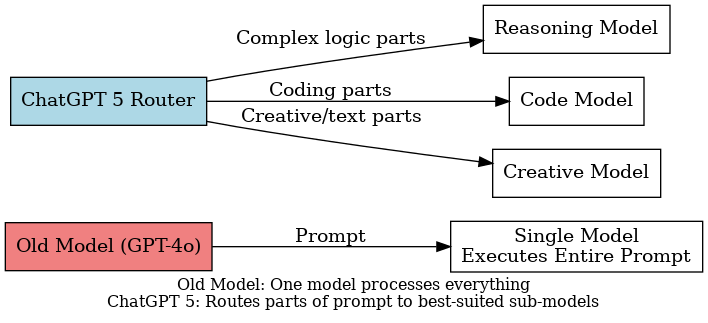

# AI Context Playbooks – ChatGPT 5 Prompt Reskilling

With the release of **ChatGPT 5**, OpenAI has introduced a *multi-model routing* capability — meaning that your prompt is no longer sent to a single fixed model. Instead, ChatGPT 5 dynamically routes different parts of your request to the most appropriate underlying model (including GPT-4o and other specialized sub-models) based on the nature of the task.

While this makes ChatGPT 5 more powerful and adaptive than GPT-4o, it also changes the way we must approach **prompt writing**:

- **Model choice is implicit** – ChatGPT 5 decides which sub-model to use based on your instructions, so the *clarity* and *specificity* of your prompts directly influence whether the best sub-model is selected.
- **Role- and task-specific framing** has a much greater effect on quality and speed of output.
- **Context density** (the right amount of relevant detail without clutter) matters more, because the router uses that context to determine optimal reasoning and style.
- **Output specification** is critical — defining the deliverable format and constraints helps ChatGPT 5 select specialized reasoning or generation paths.

For teams already comfortable with GPT-4o, this means **reskilling** in prompt design to fully leverage ChatGPT 5’s adaptive capabilities. Old habits like generic or underspecified prompts will not consistently yield the best results.

---

## Purpose of This Directory

The `ai-context-playbooks/chatgpt5-skills` directory contains reusable **prompt engineering templates** to help engineers, business staff, and domain specialists rapidly adapt their workflow for ChatGPT 5.  

The goal is to:
1. **Accelerate adoption** of ChatGPT 5’s multi-model routing advantages.
2. **Reduce trial-and-error** by giving staff structured, high-quality prompt starting points.
3. **Enable role-specific mastery** — ensuring prompts are tailored to sales, marketing, product, engineering, QA, DevOps, and more.
4. **Support side-by-side model usage** — helping users know when to prefer ChatGPT 5 vs. GPT-4o for a given task.

## Files in This Directory

### 1. `chatgpt5-meta-template.prompt.md`
A **meta-prompt generator** for creating tailored ChatGPT 5 vs. GPT-4o prompt guidance for *any* use case.

**What it does:**
- Lets you fill in placeholders for use case, role, output goal, and constraints.
- Produces side-by-side prompt templates optimized for ChatGPT 5 and GPT-4o.
- Suggests usage tips and when to prefer one model over the other.
- Generates illustrative example outputs for both models.

**When to use it:**
- When you have a new use case and want to quickly develop best-practice prompts for both models.
- As a teaching tool for onboarding staff into ChatGPT 5 prompt thinking.

### 2. `chatgpt5-role-examples.md`
A set of **pre-filled meta-prompts** for the most common roles in our organization:
- Sales – Lead Nurturing Email Sequence
- Marketing – LinkedIn Campaign Messaging
- Product Definition – PRD Creation
- Software Architecture – System Design
- QA – Automated Test Plan Generation
- DevOps – CI/CD Pipeline Design

**What it does:**
- Provides ready-to-run prompt guidance for each role.
- Encodes best practices for ChatGPT 5’s routing behavior vs. GPT-4o’s direct execution.
- Acts as a “prompt playbook” for role-specific excellence.

**When to use it:**
- When you want to skip placeholders and start from a working example.
- For internal training sessions and prompt review workshops.

## How to Use

1. **Start with the meta-template** (`chatgpt5-meta-template.prompt.md`) when exploring a *new* use case.  
   Fill in the placeholders and run the meta-prompt to produce optimized instructions for both ChatGPT 5 and GPT-4o.

2. **Refer to the role examples** (`chatgpt5-role-examples.md`) when your task matches one of the covered roles.  
   Use them directly or modify slightly for your context.

3. **Iterate** – Feed back the output into ChatGPT for refinement.  
   ChatGPT 5 is designed for interactive improvement loops; don’t settle for the first draft.

## Why This Matters

Without deliberate prompt reskilling:
- Users may unintentionally get suboptimal routing in ChatGPT 5, leading to slower or less relevant responses.
- Teams may default to GPT-4o for speed, missing the richer reasoning and cross-domain synthesis ChatGPT 5 can deliver.
- Cross-functional collaboration can suffer if prompts aren’t standardized and role-aware.

These playbooks are designed to make **high-performance prompting a repeatable skill**, so we can consistently get the best results from both ChatGPT 5 and GPT-4o.

## Next Steps

- Schedule a **prompt training workshop** to walk through these playbooks with your team.
- Encourage each department to maintain its own **prompt library** built on this structure.
- Continuously update prompts as ChatGPT 5 routing behavior evolves.
