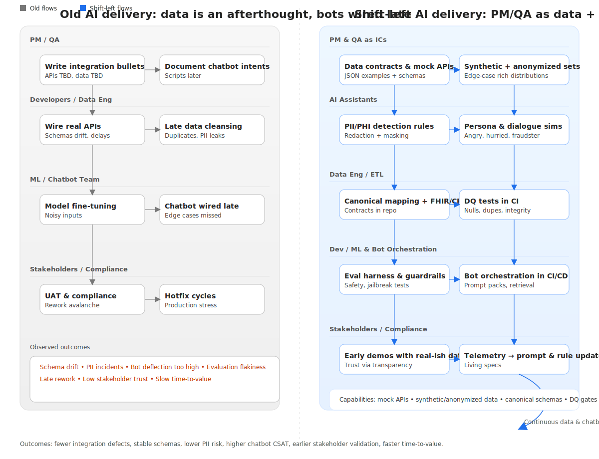

# Project Managers & QA: Shifting Left in AI Apps with Data Integration, Cleansing, and Chatbots

Most modern AI applications don’t fail because the model is weak. They fail because the *data* is messy, fragmented, and misunderstood. Integrating multiple sources, cleansing records, and shaping usable prompts for chatbots are some of the most time-consuming steps in delivery. Traditionally, these tasks were pushed to developers, data engineers, or late-stage QA after systems were already in flight.

By shifting left, PMs and QA leaders can use AI themselves to simulate integrations, prototype data cleansing rules, and generate chatbot behaviors *before development begins*. This ensures developers inherit cleaner inputs, stakeholders see early value, and “definition of done” includes not just features but *data quality and conversational quality*.

## Old World vs. New World

### Old World

* PMs write integration requirements as bullet points, developers figure out APIs later.
* QA validates cleansing rules after data has already broken downstream systems.
* Chatbot behaviors are only tested once NLP/NLU is wired into production.
* User acceptance comes late, usually after expensive rework.

### New World

* PMs and QA leaders become data ICs: they prompt AI to mock APIs, generate test payloads, and simulate system integration.
* AI is used to prototype cleansing pipelines early, flagging inconsistencies before code is committed.
* Chatbot conversations are simulated via AI prompts, producing living test suites of user dialogues.
* Data, integrations, and chatbot quality become first-class acceptance criteria.

## Strategies for Shifting Left in AI-Driven Data Projects

### 1. AI-Generated Mock APIs & Payloads

PMs can use AI to stand up synthetic API responses so developers don’t need to wait for external systems to be ready.

Example Prompt:

> “Simulate a FHIR healthcare API that returns inconsistent birthdates, missing codes, and duplicate records. Output as JSON for 50 patients.”

Now, developers build against realistic test payloads on day one. QA can immediately design assertions for duplicate detection or field normalization.

### 2. Data Cleansing Rules as Prompts

Instead of waiting for ETL developers, PMs and QA can write prompts that codify cleansing logic in natural language, then iterate with AI until rules are precise.

Example Prompt:

> “Given CSVs with mixed formats for phone numbers, create cleansing rules and Python regex patterns that normalize all numbers to E.164 format. Include test cases.”

This allows PMs and QA to hand developers *both the spec and the starter code* before sprint kickoff.

### 3. Early Chatbot Dialogue Simulation

Chatbot quality depends on anticipating user variation: slang, typos, anger, or polite queries. PMs and QA can prompt AI to generate dialogue trees that simulate real users across personas.

Example Prompt:

> “Act as five different personas asking about a bank balance: the angry customer, the hurried commuter, the confused senior, the savvy developer, and the fraudster probing for data leakage. Write transcripts.”

These transcripts become living UAT scripts. Developers know exactly how the chatbot must behave, from polite deflections to secure responses.

### 4. Synthetic Test Data with Anonymization

Modern AI apps require large, varied datasets, but customer data often cannot be shared. PMs and QA can use AI to generate anonymized or synthetic equivalents that still preserve distributions and edge cases.

* Healthcare: create synthetic patient records with realistic comorbidities but no PHI.
* Finance: generate transaction logs that mimic fraud attempts.
* Retail: simulate multilingual customer reviews with slang, misspellings, and emojis.

This means QA can validate data pipelines and chatbot NLP without compliance risk.

### 5. Living “Definition of Done” Includes Data

Traditionally, “done” meant the feature worked. In AI systems, “done” must also mean the data flows correctly and chatbot behaviors are acceptable.

* Integration Done: mock APIs tested and validated.
* Cleansing Done: cleansing rules codified and automated test sets generated.
* Chatbot Done: dialogue simulations pass with expected outcomes and secure fallback handling.

PMs and QA leaders can ensure each story includes not just functionality but data- and AI-readiness tests.

## Obvious vs. Non-Obvious Applications

Obvious:

* Generate dummy data for testing.
* Write chatbot scripts for UAT.

Non-Obvious & Innovative:

* Cross-system integrity checks: Use AI to simulate mismatched IDs across two databases and auto-generate SQL assertions to catch them.
* Bias surfacing: Ask AI to generate chatbot queries from underrepresented groups or dialects to ensure inclusive responses.
* Data chaos testing: Simulate sudden schema changes from external APIs and ensure cleansing rules still apply.
* Conversational stress testing: Generate 100 variations of a single user query to test chatbot robustness.
* Policy-aware prompts: Ensure chatbot never leaks sensitive info by prompting AI to act as a malicious user.

## Why This Matters

1. Data Integration Is the Real Bottleneck. Most AI projects stall not in model training but in connecting, cleaning, and validating data. Shift-left practices surface these issues early.

2. QA Becomes Proactive, Not Reactive. Instead of catching dirty data downstream, QA engineers *shape* the cleansing rules upfront.

3. PMs Deliver Immediate Value. By handing developers mocked APIs and chatbot scripts, PMs provide concrete artifacts that reduce ambiguity.

4. Chatbot Trust Depends on Early Simulation. Simulating user dialogues early ensures the final bot won’t embarrass the brand by mishandling simple queries.

## Call to Action

For AI-driven projects, PMs and QA cannot remain spectators until development is complete. They must become data integration contributors, cleansing designers, and chatbot scenario engineers from day one.

Organizations that empower PMs and QA to simulate integrations, codify cleansing rules, and generate chatbot dialogues early will cut rework, reduce compliance risk, and deliver AI apps that are not only functional but also trustworthy.

Shifting left in modern AI is no longer about code alone—it’s about ensuring that *data and conversations* meet quality standards before developers even open their editor.

Would you like me to also design a companion diagram (SVG) for this one, showing how PM/QA shift left into the *data + chatbot pipelines* (integration, cleansing, conversation design) alongside developers?
