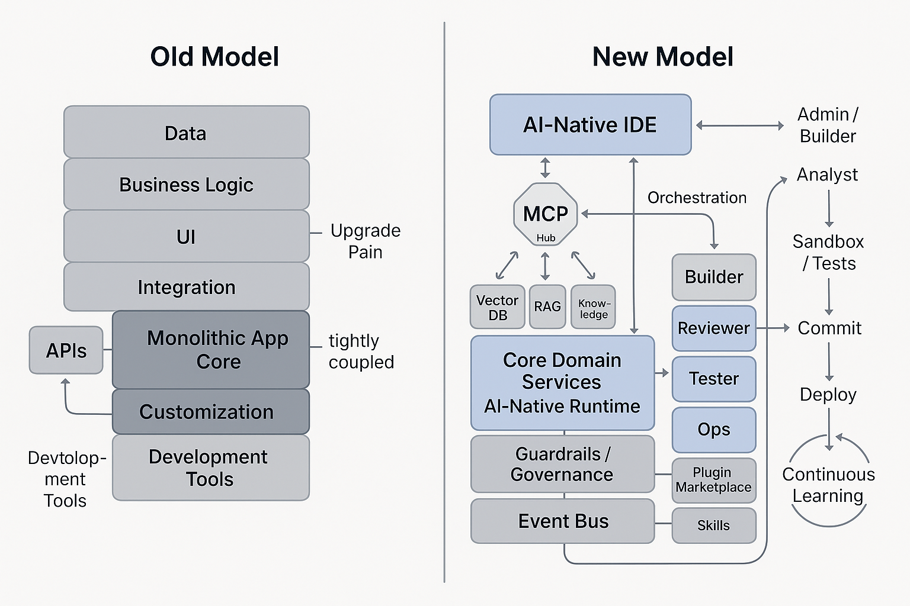

# AI Prompt to generate an AI-native enterprise software architecture diagram

Sample diagrams as inspiration:

## Diagram overview

- Extensible Data Model (explicit layer)
- Unified Database connection through an AI‑Aware Data Layer (vector index, RAG, feature store, streaming)
- Core Business Logic in Natural Language with a secure private Policy DSL for modifiable rules
- MCP hub + agents remain, with guardrails/governance and a continuous-learning loop

## Old model (left)

* App layers (top→down): UI → Business logic → Integration bus/ETL → Customization scripts/SDK → Monolithic app core.
* API box: REST/SOAP APIs (narrow surface), placed off to the side; arrow back into the core to imply platform constraints.
* Data boxes: Operational RDBMS → nightly ETL → separate data warehouse/BI (data copies).
* Coupling callouts:

  * Tight coupling: UI, logic, integration, and data bound to vendor core.
  * Plugin marketplace (fragile): version drift, vendor upgrade breaks.
  * Upgrade pain: vertical bracket spanning UI→core→DB.
  * Multi-DB sprawl: app DBs + shadow spreadsheets.

* Governance/ops (small boxes at bottom): manual release pipeline, change tickets, auditor after-the-fact.

Optional clarifiers to add

* Siloed identities/roles.
* Limited test automation; change windows required.
* Observability after deployment, not at design time.

## New model (right)

* Top swimlane: Design-time

  * AI-native IDE (prompt chat + diff view + code/flow editor).
  * MCP hub (Model Context Protocol) connecting tools, data, and services.
  * Agent mesh: Builder, Reviewer, Tester, Ops (policy-constrained).
  * Sandbox/tests → commit → deploy arrows; feedback loop back to IDE.

* Core runtime block: Core domain services + AI-native runtime

  * Natural-language business logic (compiled to flows/code) side-by-side with a private, secure, auditable Policy DSL.
  * Guardrails/governance: policy engine, RBAC/ABAC, PII redaction, content filters, allow/deny tools.
  * Event bus for everything (domain events, audit events).
  * Skills/plugin marketplace (versioned, signed, hot-swappable).

* Data plane (attach visually beneath core)

  * AI-aware data layer: vector index + RAG, feature store, streaming/logs, time-series, document store.
  * Unified operational + analytical database (HTAP/lakehouse) feeding both app and AI features.
  * Extensible data model: schema registry, knowledge graph option, data products with contracts.
  * LLM/AI gateway: routing, model selection, safety, cost/latency policies.

* Trust boundaries (thin dashed boxes)

  * Tenant boundary: per-tenant data + policies.
  * Model boundary: third-party models vs. private foundation models.

* Observability everywhere

  * Design-time telemetry (prompt/agent traces), runtime traces/metrics/logs, evals, drift monitors.

* Continuous learning loop

  * User actions → evals → fine-tuning/heuristics → policy updates → regenerated artifacts with approvals.

## Terminology

* Extensible data model → Extensible data model / knowledge graph (use both if you want emphasis).
* AI-aware data layer → LLM/AI gateway + AI-aware data layer (two boxes: gateway sits above).
* Unified database → Unified operational + analytical store (HTAP/lakehouse).
* Policy DSL → Private policy DSL (secure, auditable, compilable), with a small example bubble:
  * “When record contains PHI and requester is not in CareTeam, mask fields X/Y/Z.”
* MCP hub → MCP hub (tools, data, model routers) with thin lines to IDE, agents, gateway, and data layer.
* Agent mesh → Agent mesh (builder/reviewer/tester/ops) with badges showing scopes granted by policy.

# Legend (bottom or side)

* Solid arrows: synchronous calls.
* Dashed arrows: orchestration/approvals.
* Dotted arrows: telemetry/evals.
* Lock icon: trust boundary.
* Diamond icon: policy decision points (allow/deny/tool-use).
* Color hinting: design-time (cool), runtime (neutral), data plane (warm), governance (accent).

## Side-by-side one-liners

* Old: “Configuration-heavy, code-light… until you need something real → then brittle custom code bound to the core.”
* New: “Intent-first, policy-safe extensibility: natural language + DSL → reproducible code/flows with guardrails.”

## Generate the diagram with:

* knowledge graph added to the data model
* LLM/AI gateway separated from the AI-aware data layer
* explicit trust boundaries
* example Policy DSL bubble
* a compact legend in the footer
